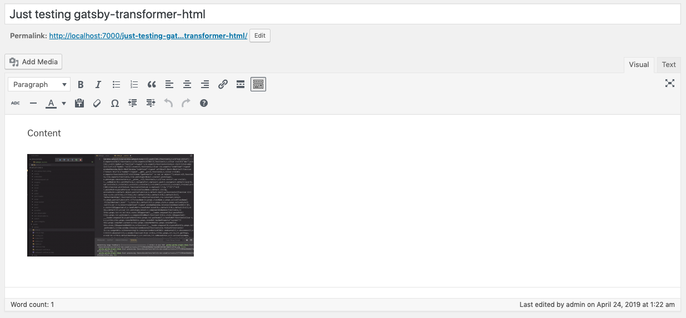
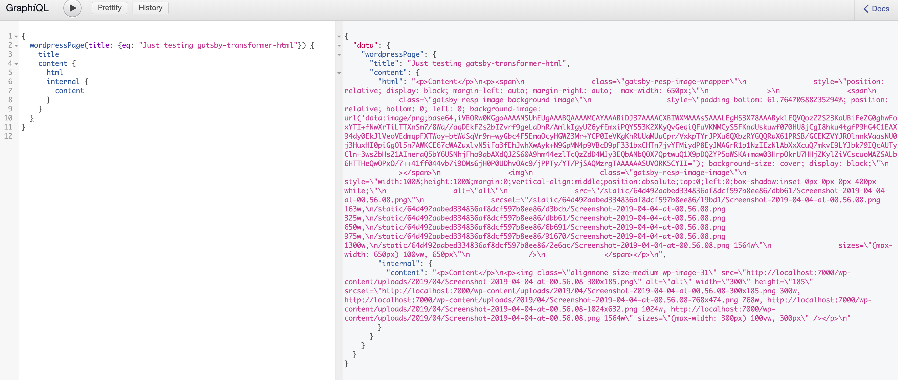
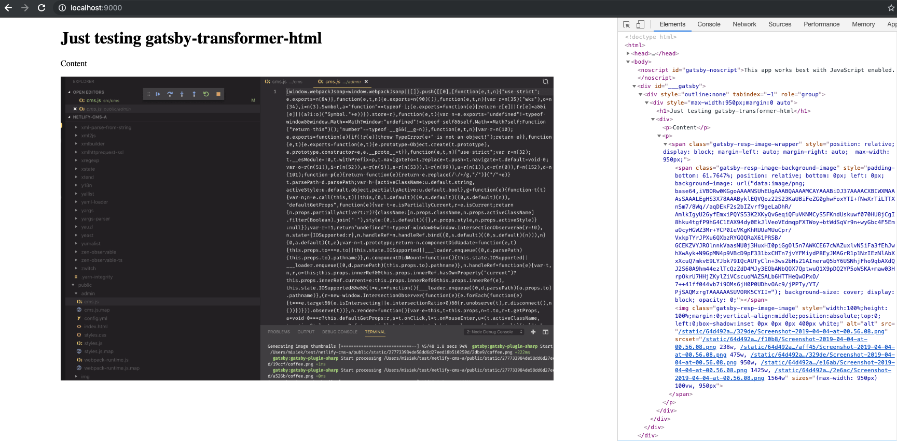

# gatsby-transformer-html proof of concept

## Testing setup and results:

- Wordpress admin - sample page with inline image:

  

- GraphiQL - using `content` field that is transformed from string to virtual HTML node type field thanks to schema customization magic (see gatsby-node in "Things to look for" section). Shows input (`internal.content`) and output of transformer (`html`)

  

- Used in practice (see page component and query example):

  

## Things to look for:

- gatsby-config (configuring gatsby-transformer-html and gatsby-html-images) - https://github.com/pieh/html-transformer-wp/blob/master/packages/site/gatsby-config.js#L10-L22
- gatsby-node (specyfing WordpressPage.content as html field, so transformer is being used) - https://github.com/pieh/html-transformer-wp/blob/master/packages/site/gatsby-node.js#L1-L13
- page component and query example - https://github.com/pieh/html-transformer-wp/blob/master/packages/site/src/pages/index.js
